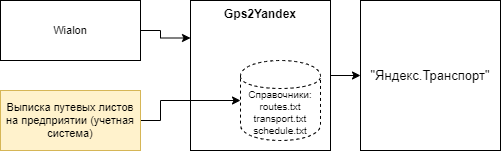

# Ретранслятор в "Яндекс.Транспорт"

## Описание

Интеграционный модуль "Gps2Yandex" отвечает за прием GPS данных c "Wialon", дополняет данными о том, по какому маршруту движется 
транспортное средство и эти сведения направляет в "Яндекс.Транспорт".

## Архитектура решения

* Модуль "Gps2Yandex" принимает ретрансляционный сигнал с GPS данными от "Wialon" по протоколу **Wialon IPS**. Настройки 
для приема сигнала модулем находятся в [settings.md](./documents/settings.md)
* В модуле "Gps2Yandex" используются [Справочники](./documents/file_format.md) (**routes.txt** и **transport.txt**), которые необходимы
для связывания данных, поступающих от "Wialon" с расписанием (**schedule.txt**).

При изменении справочников модуль "Gps2Yandex" подхватывает новые данные на лету, т.е. перезапуск модуля не требуется.

**Примечание:** *справочники **routes.txt** и **transport.txt** допустимо заполнять в ручную, так как изменяются редко.**

**Примечание:** *данные о расписании **schedule.txt** необходимо записывать в файл с помощью внешней системы. 
Файл содержит информацию о расписании на текущий момент времени, а так же допустимо на несколько часов в перед.**

**Внимание:** *При перестановке транспортного средства с одного маршрута на другой, снятие его с рейса -
 данные изменения должны быть отображены в расписании.*
 
