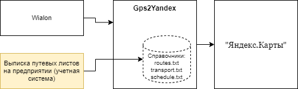

## ⚠️ Внимание

Этот репозиторий больше не поддерживается.  
Дальнейшее развитие проекта осуществляется в [github.com/bars43ru/bus2map](https://github.com/bars43ru/bus2map).

# Интеграционный модуль Gps2Yandex

## Описание

Интеграционный модуль "Gps2Yandex" отвечает за прием GPS данных c "Wialon", дополняет данными о том, по какому маршруту движется 
транспортное средство и эти сведения направляет в "Яндекс.Карты".

## Архитектура решения

* Модуль "Gps2Yandex" принимает ретрансляционный сигнал с GPS данными от "Wialon" по протоколу **Wialon IPS**. Описание настройки 
для приема сигнала модулем находятся в [settings.md](./docs/settings.md)
* В модуле "Gps2Yandex" используются [Справочники](./docs/file_format.md) (**route.txt** и **transport.txt**), которые необходимы
для связывания данных, поступающих от "Wialon" с расписанием (**schedule.txt**).

При изменении справочников модуль "Gps2Yandex" подхватывает новые данные на лету, т.е. перезапуск модуля не требуется.

**Примечание:** *справочники **route.txt** и **transport.txt** допустимо заполнять в ручную, так как изменяются редко.**

**Примечание:** *данные о расписании **schedule.txt** необходимо записывать в файл с помощью внешней системы. 
Файл содержит информацию о расписании на текущий момент времени, а так же допустимо на несколько часов вперед.**

**Внимание:** *При перестановке транспортного средства с одного маршрута на другой, снятие его с рейса -
 данные изменения должны быть отображены в расписании.*
 
Пример внедрения: 

* [г. Слободской](https://yandex.ru/maps/11073/slobodskoy/transport/?ll=50.186608%2C58.726874&z=13.6)
* г. Пенза (маршруты [149](https://yandex.ru/maps/49/penza/routes/minibus_149/796d617073626d313a2f2f7472616e7369742f6c696e653f69643d32323337363736363831266c6c3d34352e30343932333425324335332e313831313831266e616d653d31343926723d3530393426747970653d6d696e69627573/?l=masstransit&ll=45.024286%2C53.187801&z=13.49), [165](https://yandex.ru/maps/49/penza/routes/bus_165/796d617073626d313a2f2f7472616e7369742f6c696e653f69643d32323337363736363834266c6c3d34352e30343135353225324335332e323934373535266e616d653d31363526723d313037313526747970653d627573/?l=masstransit&ll=45.035154%2C53.233426&z=13), [411](https://yandex.ru/maps/118031/zasechnoe/routes/bus_411/796d617073626d313a2f2f7472616e7369742f6c696e653f69643d34395f3431315f6d696e696275735f72636170656e7a61266c6c3d34352e30353639313225324335332e313136333337266e616d653d34313126723d3238323826747970653d627573/?l=masstransit&ll=45.052895%2C53.130208&z=13))
